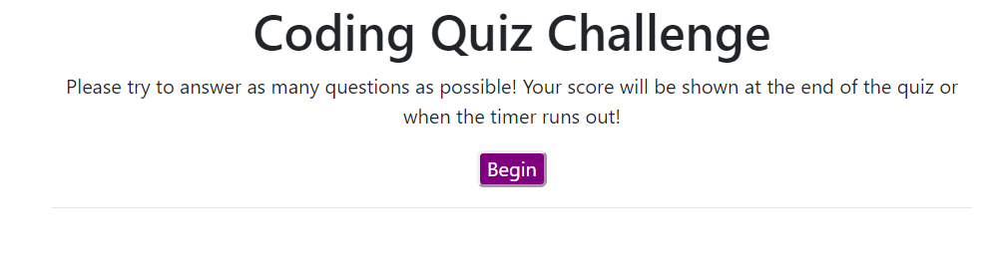
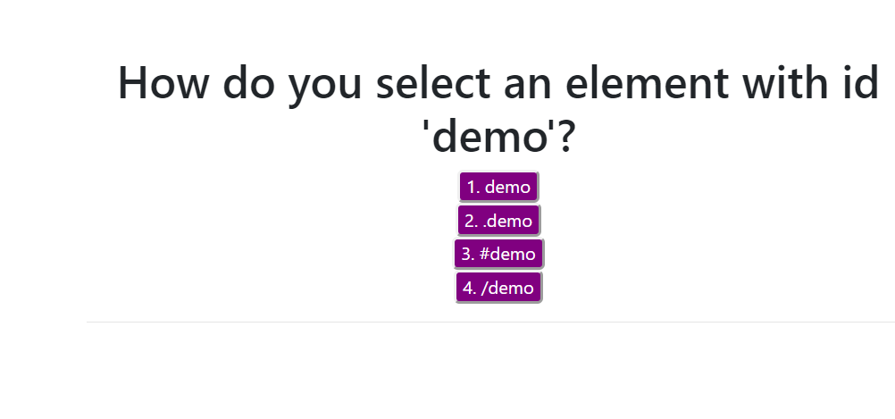
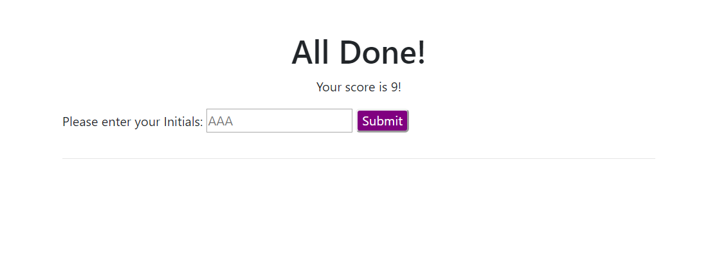
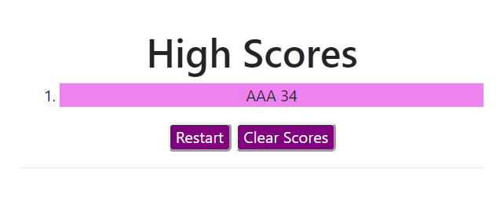

# Code Quiz
This application will present a quiz on HTML, CSS, JS, Bootstrap, and JQuery. 

## Description
The quiz consists of 8 Multiple Choice Questions each with 4 possible answers. The timer starts upon pressing the Begin button. Upon each right or wrong answer, text will flash letting you know your result. Upon completion of the quiz, your score will be equal to however many seconds you had left in the timer. If you type in your initials, your high scores will be displayed. At this point, you can either try again for a better score or clear the score list.

### Visuals

#### Installation
No installation necessary. The program is ready to run.

https://alexjoeldelgado.github.io/CodeQuiz/

##### Licenses
No licenses necessary. Feel free to use my code.

###### Author
Alexander Delgado
